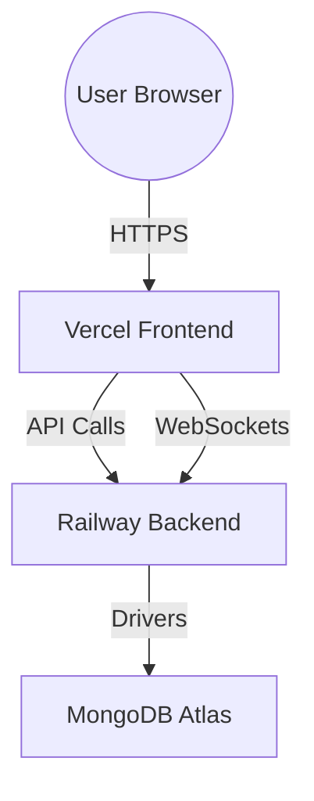

# 🏫 Bright Future Academy - School Management System

A premium, full-stack MERN (MongoDB, Express, React, Node) application designed for modern educational institutions. This system provides a unified, real-time platform for Administrators, Teachers, Students, and Secretaries.

---

## 🏗️ System Architecture
The system is built on a modular architecture optimized for high-performance cloud deployment.

---

## 🚀 Deployment Guide (Production)

### 1. Backend (Railway)
1.  **Repository**: Connect your GitHub.
2.  **Root Directory**: Set to `backend`.
3.  **Build Command**: `npm install`
4.  **Start Command**: `npm start`
5.  **Environment Variables**:
    - `MONGO_URI`: Your MongoDB Atlas connection string.
    - `JWT_SECRET`: A secure random string.
    - `CORS_ORIGIN`: Your frontend URL (e.g. `https://your-app.vercel.app`).
    - `PORT`: 5000 (Railway will assign this automatically).

### 2. Frontend (Vercel)
1.  **Repository**: Connect your GitHub.
2.  **Root Directory**: Set to `frontend`.
3.  **Framework Preset**: `Create React App`.
4.  **Build Command**: `npm run build`.
5.  **Output Directory**: `build`.
6.  **Environment Variables**:
    - `REACT_APP_API_URL`: `https://your-backend-url.up.railway.app/api`

---

## 🧩 Core Modules
- **💳 Payment & Billing**: Full tuition management. Automatic discount application & partial payment tracking.
- **📚 E-Learning Hub**: Digital classroom for lesson uploads, assignment submissions, and grading.
- **📊 Advanced Analytics**: Real-time performance tracking using dynamic charts for attendance and grades.
- **📢 Real-time Notifications**: Instant alerts via WebSockets for messages and events.
- **🏛️ Role-Based Access**: Specialized portals for Admins, Teachers, Students, and Secretaries.

---

## 🛠️ Local Development
1. **Clone**: `git clone https://github.com/your-username/your-repo.git`
2. **Backend**: `cd backend && npm install && npm run dev`
3. **Frontend**: `cd frontend && npm install && npm start`
4. **Seed Data**: `cd backend && node seed_all.js` (Populates 10+ records for testing)

---

## 🔒 Security & Best Practices
- **No Docker Required**: Optimized for native Node.js execution on Railway/Vercel.
- **Environment Isolation**: Sensitive keys are managed via `.env` files.
- **Security Headers**: Powered by `helmet.js` and strict `CORS` policies.
- **Scalable Real-time**: Socket.io configured for cross-domain stability.
